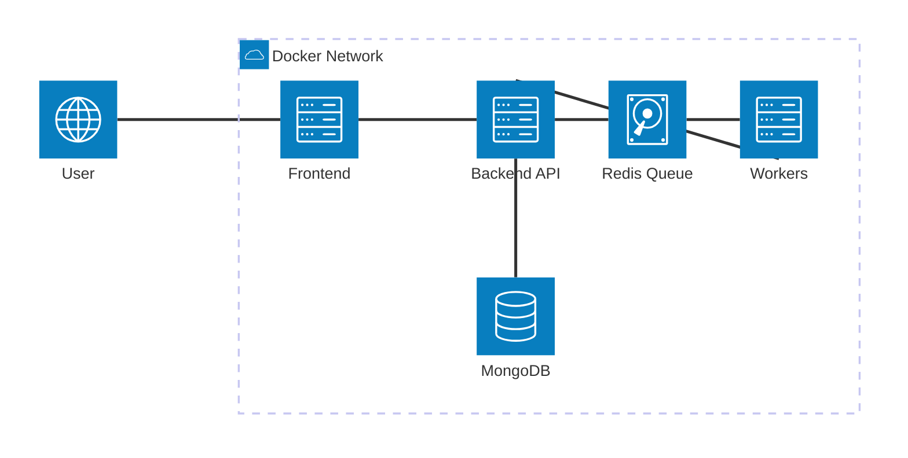
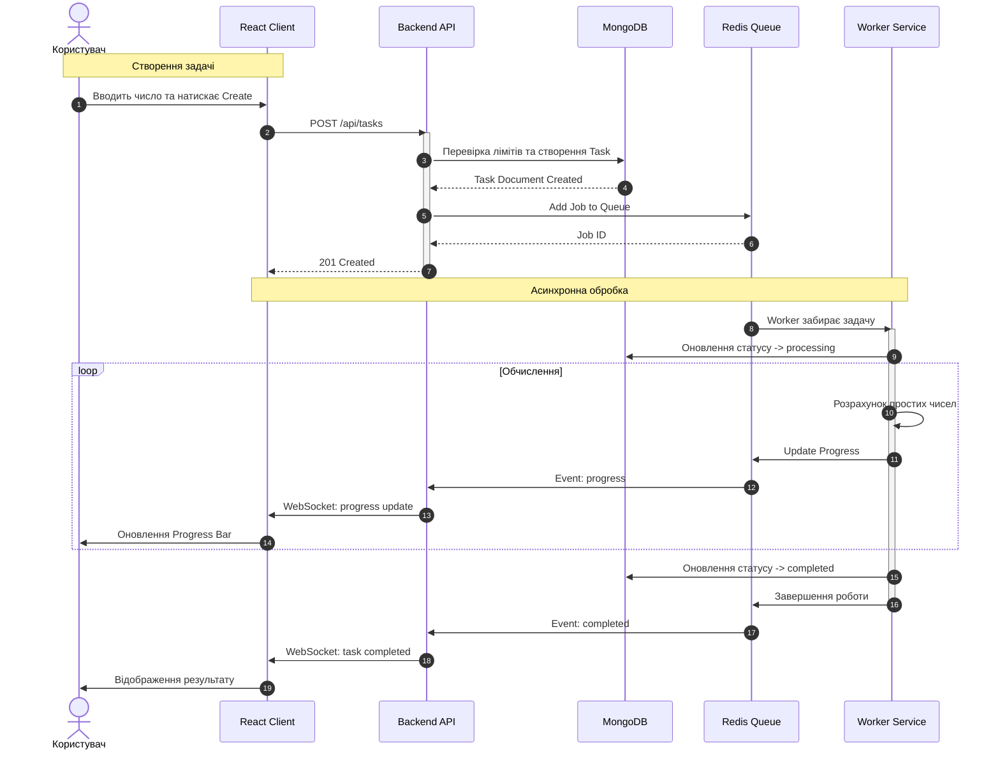

# Веб застосунок для обробки трудомістких запитів користувача
<span>* в якості трудомісткої операції використовується "симуляція" - обчислення кількості простих чисел в діапазоні [1, n], де n - число введене користувачем</span>

### :computer: Технології
* React (Vite)
* Node.js
* BullMQ
* WebSockets
* MongoDB
* Mongoose
* MUI

### :triangular_ruler: Архітектура 

### :loop: Sequence diagram


### :rocket: Швидкий запуск 
#### 1. Клонування репозиторію
```bash
git clone <repository_link>
cd WEB_PROJECT
```
#### 2. Запуск через Docker
```bash
docker-compose up --build
```
 Якщо бажаєте вказати явно кількість контейнерів з worker (по дефолту запускається 1):
 ```bash
docker-compose up --build --scale=кількість_воркерів
```
#### 3. Перегляд проекту в браузері
Головна сторінка: http://localhost:3000

### :round_pushpin: Доступні ендпоінти
Для звичайного користувача (після логіну/реєстрації):
```bash
POST tasks/ - створити завдання
GET tasks/ - переглянути усі завдання
GET tasks/:jobId - отримати статус конкретного завдання
POST tasks/:jobId/cancel - скасувати завдання
```
Для адміністратора:
```bash
GET /overview - загальні дані про систему, кількість завдань за статусами і тд
GET /tasks - усі завдання в системі
GET /users - усі користувачі системи
POST /tasks/:jobId/cancel - скасування задачі (будь-якої)
```

